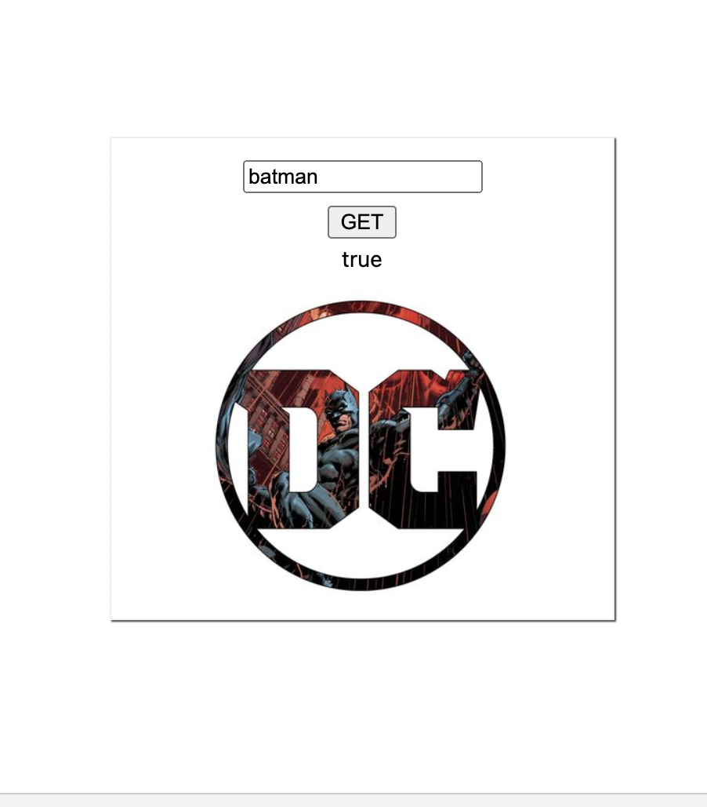

Example of getting instagram profile picture by username.

# Firebase version

1. Put `firebase_auth.json` file with credentials from Firebase -> Project Setting -> Service Accounts
2. Modify `bucketId` and `bucketPath` in top of app.mjs to your bucket name and folder inside.

## Cors

To access files directly from firebase storage in client side, you may need to setup bucket cors:

https://firebase.google.com/docs/storage/web/download-files#cors_configuration

__Example with firebase support in `firebase` branch.__

1. Get profile info with public api `?__a=1`
2. Get profile_pic_hd url
3. Obtain profile image and store it in firebase storage
4. Response to client side

Note: watch on your request rate or you will be blocked from instagram